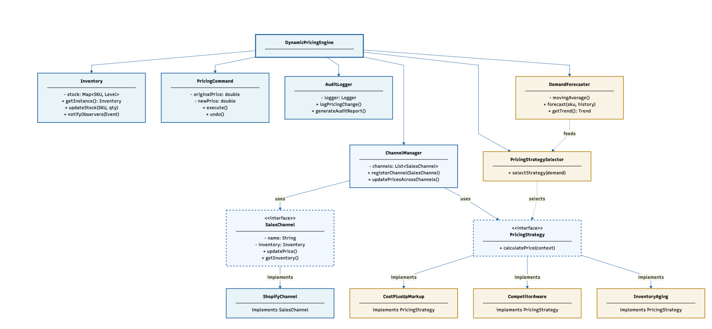

# CSYE 6300 - Final Project Submission

## 1. Project Group Number/Name
Group 1

## 2. Project Topic/Name
**Dynamic Pricing Engine for Multi-Channel DTC Retail**

## 3. Problem Statement
Direct-to-consumer (DTC) brands operating across multiple sales channels (Shopify, own website, social commerce) struggle with manual, inconsistent pricing that doesn't adapt to market demand. Our project addresses this by building a unified Dynamic Pricing Engine that forecasts sales demand in real-time, automatically selects the optimal pricing strategy based on market conditions, and synchronizes prices across channels with full audit logging. The system demonstrates how Gang of Four design patterns solve real-world inventory and pricing problems while incorporating lightweight machine learning for demand-driven decision making. By combining predictive analytics with proven design patterns, we create a modular, extensible platform that DTC brands can use to optimize revenue while respecting brand positioning constraints.

## 4. UML Diagram

```mermaid
classDiagram
    %% ===================== PRICING (Strategy) =====================
    class PricingContext {
        -sku String
        -cost double
        -currentPrice double
        -competitorPrice double
        -daysInInventory int
        -unitsInStock int
        -minPrice double
        -maxPrice double
        +applyGuardrails(price double) double
        +hasMinPrice() boolean
        +hasMaxPrice() boolean
    }

    class PricingStrategy {
        <<interface>>
        +calculatePrice(context PricingContext) double
        +getName() String
    }
    class CostPlusMarkupStrategy {
        -markupPercentage double
        +calculatePrice(context PricingContext) double
    }
    class CompetitorAwarePricingStrategy {
        -undercutPercentage double
        +calculatePrice(context PricingContext) double
    }
    class InventoryAgingStrategy {
        -DAYS_THRESHOLD int
        -MAX_DISCOUNT double
        +calculatePrice(context PricingContext) double
    }

    PricingStrategy <|.. CostPlusMarkupStrategy
    PricingStrategy <|.. CompetitorAwarePricingStrategy
    PricingStrategy <|.. InventoryAgingStrategy
    PricingStrategy ..> PricingContext : uses

    class PricingStrategySelector {
        -risingStrategy PricingStrategy
        -stableStrategy PricingStrategy
        -fallingStrategy PricingStrategy
        +selectStrategy(trend Trend) PricingStrategy
    }
    PricingStrategySelector o-- PricingStrategy
    PricingStrategySelector ..> Trend

    %% ===================== COMMAND (+ Decorator) =====================
    class PriceReceiver {
        <<interface>>
        +setPrice(sku String, price double)
        +getPrice(sku String) double
    }
    class PricingCommand {
        <<interface>>
        +execute()
        +undo()
        +getSku() String
        +getOriginalPrice() double
        +getNewPrice() double
    }
    class UpdatePriceCommand {
        -receiver PriceReceiver
        -sku String
        -originalPrice double
        -newPrice double
        +execute()
        +undo()
    }
    class AuditLoggingCommandDecorator {
        -wrapped PricingCommand
        -auditTrail List~String~
        -GLOBAL_AUDIT_TRAIL List~String~
        +execute()
        +undo()
        +generateAuditReport() List~String~
        +getGlobalAuditTrail() List~String~
    }
    class PricingCommandInvoker {
        -undoStack Deque~PricingCommand~
        -redoStack Deque~PricingCommand~
        +executeCommand(command PricingCommand)
        +undo() boolean
        +redo() boolean
        +historySize() int
    }

    PricingCommand <|.. UpdatePriceCommand
    PricingCommand <|.. AuditLoggingCommandDecorator
    UpdatePriceCommand --> PriceReceiver
    AuditLoggingCommandDecorator o-- PricingCommand : wraps
    PricingCommandInvoker o-- PricingCommand

    %% ===================== CHANNEL (Factory Method) =====================
    class SalesChannel {
        <<interface>>
        +getName() String
        +getInventory() Inventory
        +publishPrice(sku String)
    }
    PriceReceiver <|-- SalesChannel

    class ShopifyChannel {
        -apiClient ShopifyApiClient
        -inventory Inventory
        -localPriceCache Map~String,Double~
        +publishPrice(sku String)
    }
    class OwnWebsiteChannel {
        -inventory Inventory
        -priceBook Map~String,Double~
        +publishPrice(sku String)
    }
    class SocialCommerceChannel {
        -inventory Inventory
        -priceBook Map~String,Double~
        +publishPrice(sku String)
    }
    SalesChannel <|.. ShopifyChannel
    SalesChannel <|.. OwnWebsiteChannel
    SalesChannel <|.. SocialCommerceChannel
    ShopifyChannel --> ShopifyApiClient
    ShopifyChannel --> Inventory
    OwnWebsiteChannel --> Inventory
    SocialCommerceChannel --> Inventory

    class SalesChannelFactory {
        <<enumeration>> ChannelType
        +createChannel(type ChannelType) SalesChannel
    }
    SalesChannelFactory ..> ShopifyChannel : creates
    SalesChannelFactory ..> OwnWebsiteChannel : creates
    SalesChannelFactory ..> SocialCommerceChannel : creates

    class ChannelManager {
        -channels List~SalesChannel~
        +registerChannel(channel SalesChannel)
        +updatePricesAcrossChannels(sku String, price double)
    }
    ChannelManager o-- SalesChannel

    %% ===================== INVENTORY (Singleton + Observer) =====================
    class Inventory {
        <<Singleton>>
        -instance Inventory
        -stock Map~String,Integer~
        -observers List~InventoryObserver~
        +getInstance() Inventory
        +updateStock(sku String, newQuantity int)
        +adjustStock(sku String, delta int)
        +getStock(sku String) int
        +loadFromRepository(repository InventoryRepository)
        +addObserver(observer InventoryObserver)
    }
    class InventoryObserver {
        <<interface>>
        +onStockChanged(event StockChangeEvent)
    }
    class InventoryPersistenceObserver {
        -repository InventoryRepository
        +onStockChanged(event StockChangeEvent)
    }
    class InventoryRepository {
        -emf EntityManagerFactory
        +upsertStock(sku String, quantity int)
        +findStock(sku String) int
        +findAll() Map~String,Integer~
    }
    class InventoryEntity {
        -sku String
        -quantity int
    }
    class StockChangeEvent {
        -sku String
        -previousQuantity int
        -newQuantity int
        +getDelta() int
    }

    Inventory o-- InventoryObserver : notifies
    Inventory ..> StockChangeEvent : creates
    Inventory --> InventoryRepository : loads from
    InventoryObserver <|.. InventoryPersistenceObserver
    InventoryPersistenceObserver --> InventoryRepository
    InventoryRepository --> InventoryEntity

    %% ===================== FORECAST (Adapter) =====================
    class DemandDataPoint {
        -sku String
        -date LocalDate
        -unitsSold double
    }
    class RawDemandSignal {
        -productCode String
        -isoDate String
        -orderCount int
        -avgUnitsPerOrder int
    }
    class DemandSignalAdapter {
        +adapt(raw RawDemandSignal) DemandDataPoint
    }
    class DemandSignalRepository {
        -csvPath Path
        -adapter DemandSignalAdapter
        +loadDemandHistoryBySku() Map~String,List~DemandDataPoint~~
    }
    class DemandForecaster {
        -SHORT_WINDOW int
        -LONG_WINDOW int
        +movingAverage(history List~DemandDataPoint~, windowSize int) double
        +forecastTrend(history List~DemandDataPoint~) Trend
    }
    class Trend {
        <<enumeration>>
        RISING
        FALLING
        STABLE
    }

    DemandSignalAdapter ..> RawDemandSignal
    DemandSignalAdapter ..> DemandDataPoint : creates
    DemandSignalRepository --> DemandSignalAdapter
    DemandSignalRepository ..> DemandDataPoint
    DemandForecaster ..> DemandDataPoint
    DemandForecaster ..> Trend : returns

    %% ===================== WORKFLOW (Template Method + Observer) =====================
    class PricingInputsProvider {
        <<interface>>
        +getCost(sku String) double
        +getCurrentPrice(sku String) double
        +getCompetitorPrice(sku String) double
        +getDaysInInventory(sku String) int
        +getMinPrice(sku String) double
        +getMaxPrice(sku String) double
    }
    class ForecastInsight {
        <<record>>
        +trend String
        +strategyName String
    }
    class RepricingWorkflow {
        <<abstract>>
        +reprice(sku String) void
        +previewForecast(sku String) ForecastInsight
        #fetchDemandHistory(sku String) List~DemandDataPoint~
        #computeForecastInsight(demandHistory List~DemandDataPoint~) ForecastInsight
        #validate(sku String, demandHistory List~DemandDataPoint~) boolean
        #buildPricingContext(sku String, demandHistory List~DemandDataPoint~) PricingContext
        #execute(sku String, context PricingContext, demandHistory List~DemandDataPoint~) double
    }
    class StandardRepricingWorkflow {
        -demandHistoryBySku Map~String,List~DemandDataPoint~~
        -inputsProvider PricingInputsProvider
        -forecaster DemandForecaster
        -strategySelector PricingStrategySelector
        -channelManager ChannelManager
        -invoker PricingCommandInvoker
        -inventory Inventory
    }
    class ScheduledRepricingWorkflow {
        -scheduler ScheduledExecutorService
        +startSchedule(skus Collection~String~, initialDelay long, period long, unit TimeUnit)
        +stopSchedule()
    }
    class RepricingTriggerObserver {
        -workflow RepricingWorkflow
        +onStockChanged(event StockChangeEvent)
    }

    RepricingWorkflow <|-- StandardRepricingWorkflow
    StandardRepricingWorkflow <|-- ScheduledRepricingWorkflow
    RepricingWorkflow ..> ForecastInsight
    RepricingWorkflow ..> PricingContext
    StandardRepricingWorkflow --> PricingInputsProvider
    StandardRepricingWorkflow --> DemandForecaster
    StandardRepricingWorkflow --> PricingStrategySelector
    StandardRepricingWorkflow --> ChannelManager
    StandardRepricingWorkflow --> PricingCommandInvoker
    StandardRepricingWorkflow --> Inventory
    StandardRepricingWorkflow ..> UpdatePriceCommand : creates
    StandardRepricingWorkflow ..> AuditLoggingCommandDecorator : creates
    InventoryObserver <|.. RepricingTriggerObserver
    RepricingTriggerObserver --> RepricingWorkflow

    %% ===================== SHOPIFY (Adapter/Gateway) =====================
    class GraphQLExecutor {
        <<interface>>
        +execute(query String) String
    }
    class HttpGraphQLExecutor {
        -shopDomain String
        -accessToken String
        -httpClient HttpClient
        +execute(query String) String
    }
    class MockGraphQLExecutor {
        -products Map~String,ShopifyProduct~
        +execute(query String) String
    }
    class ShopifyApiClient {
        -executor GraphQLExecutor
        -cache Map~String,ShopifyProduct~
        +fetchProduct(sku String) ShopifyProduct
        +updatePrice(sku String, newPrice double) boolean
    }
    class ShopifyProduct {
        -sku String
        -price double
        -inventoryQuantity int
    }

    GraphQLExecutor <|.. HttpGraphQLExecutor
    GraphQLExecutor <|.. MockGraphQLExecutor
    ShopifyApiClient --> GraphQLExecutor
    ShopifyApiClient ..> ShopifyProduct : creates
```



<details>
<summary>Detailed class diagram (Mermaid)</summary>



</details>

## 5. Design Patterns Implemented

| Pattern | Type | Used For |
|---|---|---|
| Singleton | Creational | Single shared `Inventory` instance across all channels; unchanged since Milestone 2, now also seeded from/synced with the DB |
| Strategy | Behavioral | Interchangeable pricing algorithms (cost-plus, competitor-aware, inventory-aging) |
| Factory Method | Creational | Creating different channel implementations (Shopify, etc.) via `SalesChannelFactory` |
| Command | Behavioral | Encapsulating price-change requests with undo/redo support (`PricingCommand`, `PricingCommandInvoker`) |
| Decorator | Structural | Adding audit logging to pricing commands dynamically (`AuditLoggingCommandDecorator`); extended in Milestone 3 with a static, cross-command audit trail for the `/api/audit` endpoint |
| Observer | Behavioral | Triggering repricing when inventory levels change (`InventoryObserver`, `RepricingTriggerObserver`); extended in Milestone 3 with a second observer, `InventoryPersistenceObserver`, for write-through persistence |
| Adapter | Structural | Adapting demand signal data to the domain model (`DemandSignalAdapter`) |
| Template Method | Behavioral | Defining the repricing workflow skeleton: fetch → validate → execute → log (`RepricingWorkflow`); extended in Milestone 3 with a second concrete subclass, `ScheduledRepricingWorkflow` |
| Repository (non-GoF, standard persistence pattern) | — | New in Milestone 3 — `InventoryRepository` isolates JPA/Hibernate details behind a small, testable interface |

## 6. Tech Stack
- **Language**: Java (JDK 21)
- **Build Tool**: Maven 3.9+
- **Frameworks**: Spring Boot 3.3 (REST API layer, new in Milestone 3)
- **Persistence**: Hibernate/JPA + H2 (file-backed database, new in Milestone 3 — replaces the Milestone 2 CSV files for inventory)
- **IDE**: Eclipse or VS Code with Java extensions
- **Version Control**: Git + GitHub (private repo)
- **Testing**: JUnit 5 (Jupiter), Spring Boot Test (`@SpringBootTest` + `TestRestTemplate` for API integration tests)
- **Logging**: SLF4J + Logback
- **External Integration**: Shopify Admin GraphQL API via `ShopifyApiClient`. Defaults to `MockGraphQLExecutor` for credential-free testing; automatically switches to the real `HttpGraphQLExecutor` transport when `SHOPIFY_SHOP_DOMAIN` and `SHOPIFY_ACCESS_TOKEN` environment variables are set

## 7. Functionalities Implemented

### Persistent Storage (replaces CSV)
- [x] `InventoryEntity` / `InventoryRepository` — JPA/Hibernate entities and DAO-style repository backed by a file-based H2 database (`data/pricingdb`), configured via `application.properties` + `META-INF/persistence.xml`
- [x] The Inventory Singleton keeps its fast in-memory stock map (unchanged from Milestone 2) but is now seeded from the database at startup and kept in sync via `InventoryPersistenceObserver`, which writes every stock change through to the DB. Stock levels now survive an application restart

### Scheduled / Automated Repricing
- [x] `ScheduledRepricingWorkflow` — a second concrete Template Method workflow (extends `StandardRepricingWorkflow`) that reprices a configured set of SKUs on a fixed timer via `ScheduledExecutorService`, independent of any Observer-triggered stock change

### Spring Boot REST API Layer
- [x] `PricingEngineApplication` — Spring Boot entry point wiring up the exact same engine graph as the console demo (Singleton Inventory, Factory-built channels, Strategy/Selector, Command/Decorator, Template Method workflow, Observer)
- [x] `InventoryController` (`/api/inventory`) — view and adjust stock levels over HTTP
- [x] `PricingController` (`/api/pricing`) — trigger a repricing cycle and read current per-channel prices
- [x] `AuditController` (`/api/audit`) — audit-report endpoint exposing the Decorator's full compliance log, across every command the engine has ever run

### Real Shopify Integration & Dashboard
- [x] `HttpGraphQLExecutor` — real, non-mocked `GraphQLExecutor` implementation that sends queries/mutations to Shopify's Admin GraphQL API over HTTPS
- [x] `ShopifyApiClient` now picks `HttpGraphQLExecutor` or `MockGraphQLExecutor` automatically based on whether `SHOPIFY_SHOP_DOMAIN` / `SHOPIFY_ACCESS_TOKEN` are set (feature flag, zero changes needed at call sites)
- [x] `ShopifyApiClientIntegrationTest` — real network test against a Shopify dev store, skipped by default so `mvn test` stays fast and credential-free for every teammate and for grading
- [x] `DemandSignalRepository` — loads real demand history from `data/demand_signals.csv` (previously present but never read); `PricingEngineApplication` now uses it, falling back to Milestone 2 sample data only if the CSV is missing
- [x] `dashboard.html` — live operational dashboard (served at `/dashboard.html`) showing inventory, per-channel prices, demand forecast/strategy, and the audit trail via the existing REST endpoints
- [x] `index.html` — landing/architecture page (served at `/`) with the problem statement, UML diagram, and a walkthrough of all 9 design patterns

### Additional Channels & Guardrails (completed for Final Submission)
- [x] `OwnWebsiteChannel` and `SocialCommerceChannel` — additional `SalesChannel` implementations, created via the existing `SalesChannelFactory` (`ChannelType.OWN_WEBSITE`, `ChannelType.SOCIAL_COMMERCE`)
- [x] Brand-positioning guardrails — `PricingContext` now carries an optional `minPrice`/`maxPrice`, and `applyGuardrails()` clamps every strategy's candidate price into that range before it's finalized

### Console Entry Point
- [x] `Driver` — sole `main()` entry point for the console pattern demo, per course convention; delegates to `PricingEngineDemo` (renamed from `Main`), which builds and runs the full engine graph

## 8. Final Submission Deliverables
- [x] All project code (this repository)
- [ ] PowerPoint presentation (UML, operating instructions, team contributions, design patterns, third-party libraries)
- [ ] Recorded video demo (link to be added here before Canvas submission)

## 9. Build & Run

```bash
mvn compile
mvn test

# Plain-Java console demo (Singleton/Observer/Command/etc.)
# Driver is the sole console entry point (course convention); it delegates
# to PricingEngineDemo (renamed from Main), which builds and runs the engine graph.
mvn compile exec:java -Dexec.mainClass="com.csye6300.group1.pricingengine.Driver"

# Milestone 3: Spring Boot REST API (http://localhost:8080)
mvn spring-boot:run
```

### Shopify Real-Transport & Dashboard (Milestone 3)

By default the app runs against `MockGraphQLExecutor` (no credentials needed).
To point it at a real Shopify dev store instead, set these environment
variables before running:

- `SHOPIFY_SHOP_DOMAIN` — e.g. `your-dev-store.myshopify.com`
- `SHOPIFY_ACCESS_TOKEN` — your Shopify Admin API access token

With both set, `ShopifyApiClient` automatically uses `HttpGraphQLExecutor`
instead of the mock.

With the Spring Boot app running (`mvn spring-boot:run`), open
`http://localhost:8080/` for the landing/architecture page, or
`http://localhost:8080/dashboard.html` directly to view live inventory,
per-channel prices, demand forecast, and the audit trail.

## 10. Team Contributions

| Person | Milestone 2 Ownership | Milestone 3 Contribution | Final Submission Contribution |
|---|---|---|---|
| Aditi Bailur | Inventory (Singleton), Observer wiring, `PricingCommand`/`UpdatePriceCommand` | JPA/H2-backed `InventoryRepository` + `InventoryEntity` (persistent storage, replacing CSV); `ScheduledRepricingWorkflow` (new Template Method subclass); DB config; `InventoryRepositoryTest` | — |
| Yashika Lodh | `PricingStrategy` implementations, `SalesChannelFactory` | — | `OwnWebsiteChannel` and `SocialCommerceChannel` via `SalesChannelFactory`; brand-positioning price guardrails (`PricingContext.applyGuardrails()`) |
| Pratham Rathod | `AuditLoggingCommandDecorator`, `PricingCommandInvoker`, `RepricingWorkflow` | Spring Boot REST API layer (`PricingEngineApplication`, `InventoryController`, `PricingController`, `AuditController`); Milestone 3 write-up + Design Document | REST API layer documentation |
| Sai Vinayaka Venkata Prateek Kacham (Prateek) | `DemandSignalAdapter`, Shopify integration layer | Real (non-mocked) Shopify GraphQL transport (`HttpGraphQLExecutor`); CSV-backed demand history (`DemandSignalRepository`); basic web dashboard (`dashboard.html`) | Channels & Integration: Shopify HTTP transport, dashboard, integration testing; `Driver`/`PricingEngineDemo` console entry-point refactor; README updates |

## 11. GitHub Repository
https://github.com/yashika-lodh/CSYE6300_Group_1.git

## 12. Additional Documentation
- Design Document: `docs/DesignDocument_Milestone3.md`
- Milestone 2 Design Document: `docs/DesignDocument_Milestone2.md`
- Milestone 3 write-up: `Milestone3_Document.pdf`
- Final Submission slide deck: (to be added)
- Final Submission video demo link: (to be added)